# Лабораторная работа 1. Команда 10

## Часть 1. Поднимаем Postgres

Подготавим Dockerfile для нашего постгреса. Кластеризацию будем делать с помощью Patroni, а ему необходим доступ к бинарникам самого постгреса. Поэтому будем билдить образ, который сразу содержит в себе Postgres + Patroni

Напишем dockerfile

```dockerfile
FROM postgres:15
# Ставим нужные для Patroni зависимости
RUN apt-get update -y && \
 apt-get install -y netcat-openbsd python3-pip curl python3-psycopg2 python3-venv iputils-ping
# Используем виртуальное окружение, доустанавливаем, собственно, Patroni
RUN python3 -m venv /opt/patroni-venv && \
 /opt/patroni-venv/bin/pip install --upgrade pip && \
 /opt/patroni-venv/bin/pip install patroni[zookeeper] psycopg2-binary
# Копируем конфигурацию для двух узлов кластера Patroni
COPY postgres0.yml /postgres0.yml
COPY postgres1.yml /postgres1.yml
ENV PATH="/opt/patroni-venv/bin:$PATH"
USER postgres
#CMD не задаем, т.к. все равно будем переопределять его далее в compose
```
Подготавим compose файл, в котором опишем наш деплой постгреса. Так же добавим в него Zookepeer, который нужен для
непосредственного управления репликацией и определения “лидера” кластера

Напишем docker-compose.yml:

```yml
services:
  pg-master:
    build: .
    image: localhost/postgres:patroni # имя для кастомного образа из Dockerfile, можно задать любое
    container_name: pg-master # Будущий адрес первой ноды
    restart: always
    hostname: pg-master
    environment:
      POSTGRES_USER: postgres
      POSTGRES_PASSWORD: postgres
      PGDATA: '/var/lib/postgresql/data/pgdata'
    expose:
      - 8008
    ports:
      - 5433:5432
    volumes:
      - pg-master:/var/lib/postgresql/data
    command: patroni /postgres0.yml
  pg-slave:
    build: .
    image: localhost/postgres:patroni # имя для кастомного образа из Dockerfile, можно задать любое
    container_name: pg-slave # Будущий адрес второй ноды
    restart: always
    hostname: pg-slave
    expose:
      - 8008
    ports:
      - 5434:5432
    volumes:
      - pg-slave:/var/lib/postgresql/data
    environment:
      POSTGRES_USER: postgres
      POSTGRES_PASSWORD: postgres
      PGDATA: '/var/lib/postgresql/data/pgdata'
    command: patroni /postgres1.yml
  zoo:
    image: confluentinc/cp-zookeeper:7.7.1
    container_name: zoo # Будущий адрес зукипера
    restart: always
    hostname: zoo
    ports:
      - 2181:2181
    environment:
      ZOOKEEPER_CLIENT_PORT: 2181
      ZOOKEEPER_TICK_TIME: 2000

volumes:
  pg-master:
  pg-slave:

```
## 
>  **💡 Вопрос:**
> Порты 8008 и 5432 вынесены в разные директивы, expose и ports. По сути, если записать 8008 в ports, то он тоже станет exposed. В
чем разница?

>  **Ответ:**
Разница в том, что ports открывает порты для внешнего взаимодействия, а expose открывает порт только внутри сети Docker
## 
Напишем postgres0.yml:
```yml
scope: my_cluster # Имя нашего кластера
name: postgresql0 # Имя первой ноды
restapi: # Адреса первой ноды
  listen: pg-master:8008
  connect_address: pg-master:8008
zookeeper:
  hosts:
    - zoo:2181 # Адрес Zookeeper
bootstrap:
  dcs:
    ttl: 30
    loop_wait: 10
    retry_timeout: 10
    maximum_lag_on_failover: 10485760
    master_start_timeout: 300
    synchronous_mode: true
    postgresql:
      use_pg_rewind: true
      use_slots: true
      parameters:
        wal_level: replica
        hot_standby: "on"
        wal_keep_segments: 8
        max_wal_senders: 10
        max_replication_slots: 10
        wal_log_hints: "on"
        archive_mode: "always"
        archive_timeout: 1800s
        archive_command: mkdir -p /tmp/wal_archive && test ! -f /tmp/wal_archive/%f && cp %p /tmp/wal_archive/%f
  pg_hba:
    - host replication replicator 0.0.0.0/0 md5
    - host all all 0.0.0.0/0 md5
postgresql:
  listen: 0.0.0.0:5432
  connect_address: pg-master:5432 # Адрес первой ноды
  data_dir: /var/lib/postgresql/data/postgresql0 # Место хранения данных первой ноды
  bin_dir: /usr/lib/postgresql/15/bin
  pgpass: /tmp/pgpass0
  authentication:
    replication: # логопасс для репликаци, при желании можно поменять
      username: replicator
      password: rep-pass
    superuser: # админский логопасс, при желании можно поменять (в том числе в файле compose)
      username: postgres
      password: postgres
    parameters:
      unix_socket_directories: '.'
watchdog:
  mode: off
tags:
  nofailover: false
  noloadbalance: false
  clonefrom: false
  nosync: false
```
И postgres1.yml:
```yml
scope: my_cluster # Имя нашего кластера
name: postgresql1 # Имя первой ноды
restapi: # Адреса первой ноды
  listen: pg-slave:8008
  connect_address: pg-slave:8008
zookeeper:
  hosts:
    - zoo:2181 # Адрес Zookeeper
bootstrap:
  dcs:
    ttl: 30
    loop_wait: 10
    retry_timeout: 10
    maximum_lag_on_failover: 10485760
    master_start_timeout: 300
    synchronous_mode: true
    postgresql:
      use_pg_rewind: true
      use_slots: true
      parameters:
        wal_level: replica
        hot_standby: "on"
        wal_keep_segments: 8
        max_wal_senders: 10
        max_replication_slots: 10
        wal_log_hints: "on"
        archive_mode: "always"
        archive_timeout: 1800s
        archive_command: mkdir -p /tmp/wal_archive && test ! -f /tmp/wal_archive/%f && cp %p /tmp/wal_archive/%f
  pg_hba:
    - host replication replicator 0.0.0.0/0 md5
    - host all all 0.0.0.0/0 md5
postgresql:
  listen: 0.0.0.0:5432
  connect_address: pg-slave:5432 # Адрес первой ноды
  data_dir: /var/lib/postgresql/data/postgresql1 # Место хранения данных первой ноды
  bin_dir: /usr/lib/postgresql/15/bin
  pgpass: /tmp/pgpass0
  authentication:
    replication: # логопасс для репликаци, при желании можно поменять
      username: replicator
      password: rep-pass
    superuser: # админский логопасс, при желании можно поменять (в том числе в файле compose)
      username: postgres
      password: postgres
    parameters:
      unix_socket_directories: '.'
watchdog:
  mode: off
tags:
  nofailover: false
  noloadbalance: false
  clonefrom: false
  nosync: false
```

Теперь запустим контейнеры

```bash
docker-compose up -d --build
```
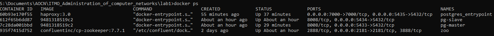

> _Скриншоты сделаны после добавления haproxy_

И посмотрим логи

```bash
docker logs <container>
```
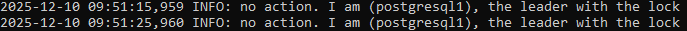

Видим что slave является лидером.

## 
>  **💡 Вопрос:**
> При обычном перезапуске композ-проекта, будет ли сбилден заново образ? А если предварительно отредактировать файлы
postgresX.yml? А если содержимое самого Dockerfile? Почему?

>  **Ответ:**
Нет, билд образа не произойдёт, если этого явно не указать __--build__.    
В первом случае docker-compose будет использовать уже существующий образ (зачем его пересобирать?).   
Во втором случае меняется только конфигурация сервиса.   
В последнем - изменения не будут применены, так как docker-compose не отслеивает изменения в dockerfile.   
Всё это сделано для экономии производительности.
## 

## Часть 2. Проверяем репликацию

Так получилось, что master стал репликой. Проверим, что в него ничего не записать:

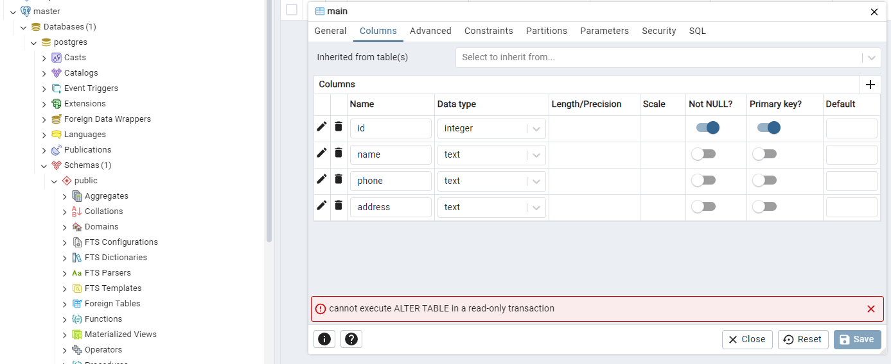

Теперь проверим, что в slave можно что-то записать:

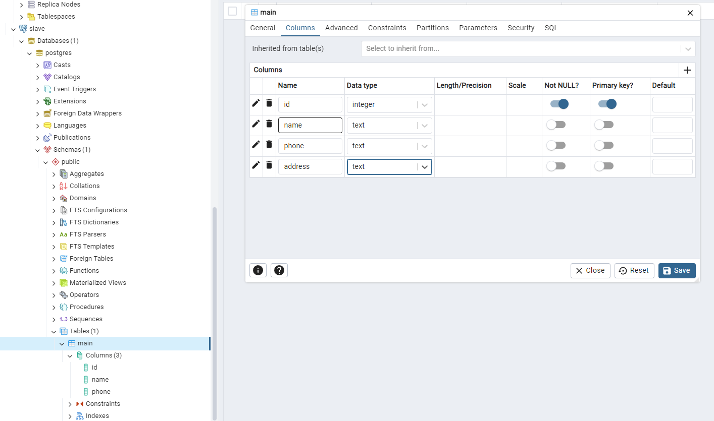
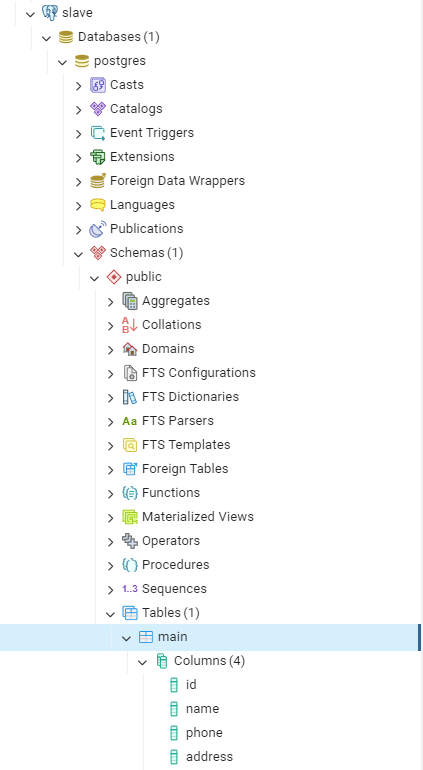

## Часть 3. Делаем высокую доступность

Добавим HAProxy в docker-compose.yml (на порту 5435, чтобы не было конфликта):

```yml
  haproxy:
    image: haproxy:3.0
    container_name: postgres_entrypoint # Это будет адрес подключения к БД, можно выбрать любой
    ports:
      - 5435:5432 # Это будет порт подключения к БД, можно выбрать любой
      - 7000:7000
    depends_on: # Не забываем убедиться, что сначала все корректно поднялось
      - pg-master
      - pg-slave
      - zoo
    volumes:
      - ./haproxy.cfg:/usr/local/etc/haproxy/haproxy.cfg
```
Также напишем haproxy.cfg

```
global
    maxconn 100
defaults
    log global
    mode tcp
    retries 3
    timeout client 30m
    timeout connect 4s
    timeout server 30m
    timeout check 5s
listen stats
    mode http
    bind *:7000
    stats enable
    stats uri /
listen postgres
    bind *:5432 # Выбранный порт из docker-compose.yml
    option httpchk
    http-check expect status 200 # Описываем нашу проверку доступности (в данном случае обычный HTTP-пинг)
    default-server inter 3s fall 3 rise 2 on-marked-down shutdown-sessions
    server postgresql_pg_master_5432 pg-master:5432 maxconn 100 check port 8008 # Адрес первой ноды постгреса
    server postgresql_pg_slave_5432 pg-slave:5432 maxconn 100 check port 8008 # Адрес второй ноды постгреса

```
После успешного запуска попробуем подключиться через haproxy   
> _Это была самая сложная часть, так как почему-то pgAdmin не мог подключиться через haproxy_

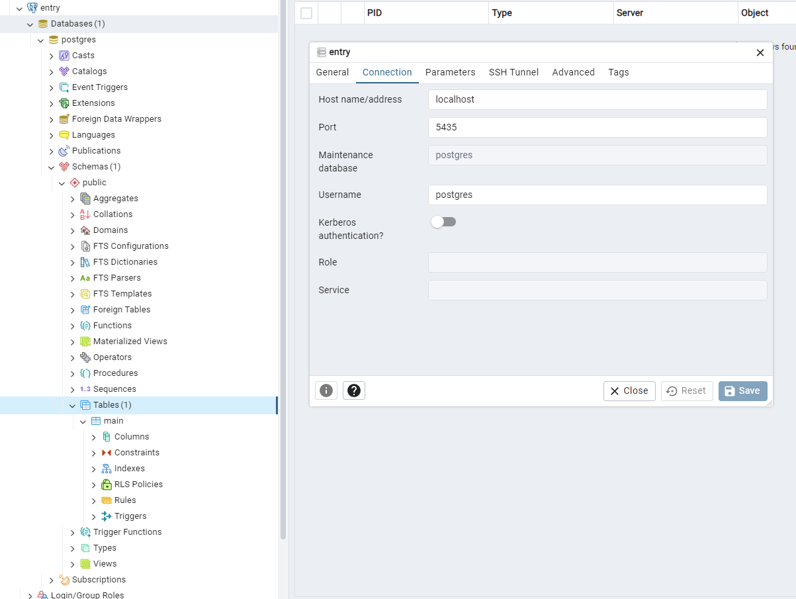

Теперь отключим slave, так как он является лидером.

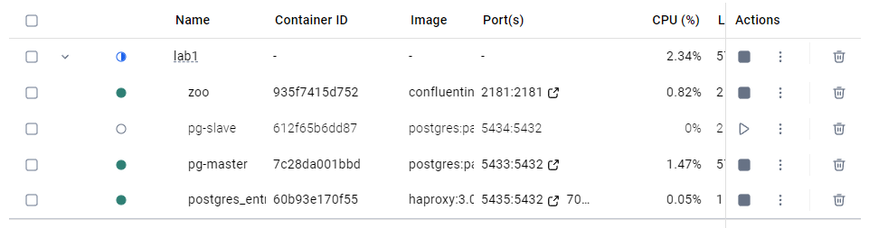

master стал лидером.

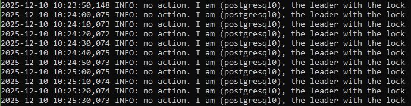

Попробуем добавить колонку через entry.

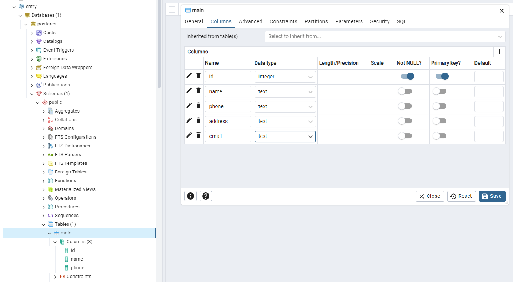
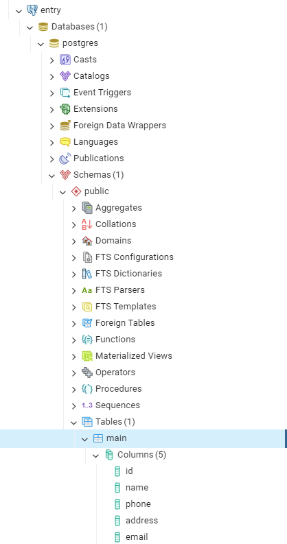

После выключения лидера slave, реплика master стала лидером. После этого entry передал туда запрос на создание колонки и всё отработало.

> _Кроме того, если вернуть slave, то он станет репликой и успешно скопирует данные_

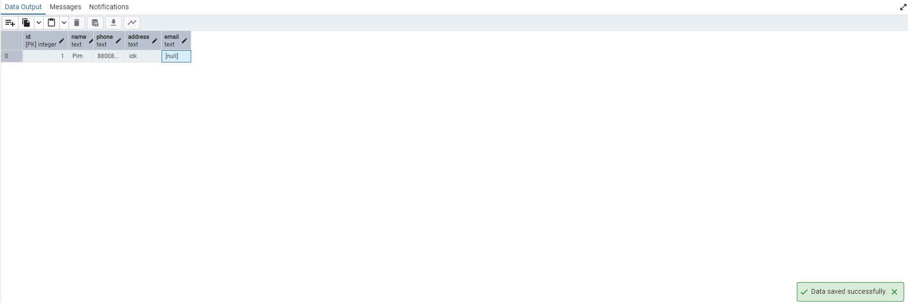
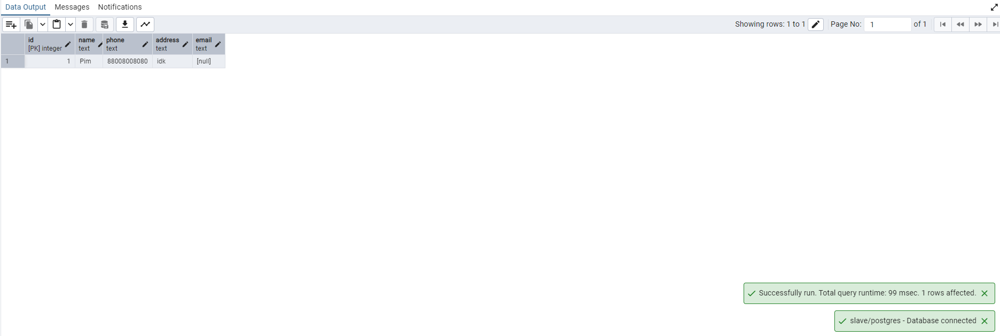